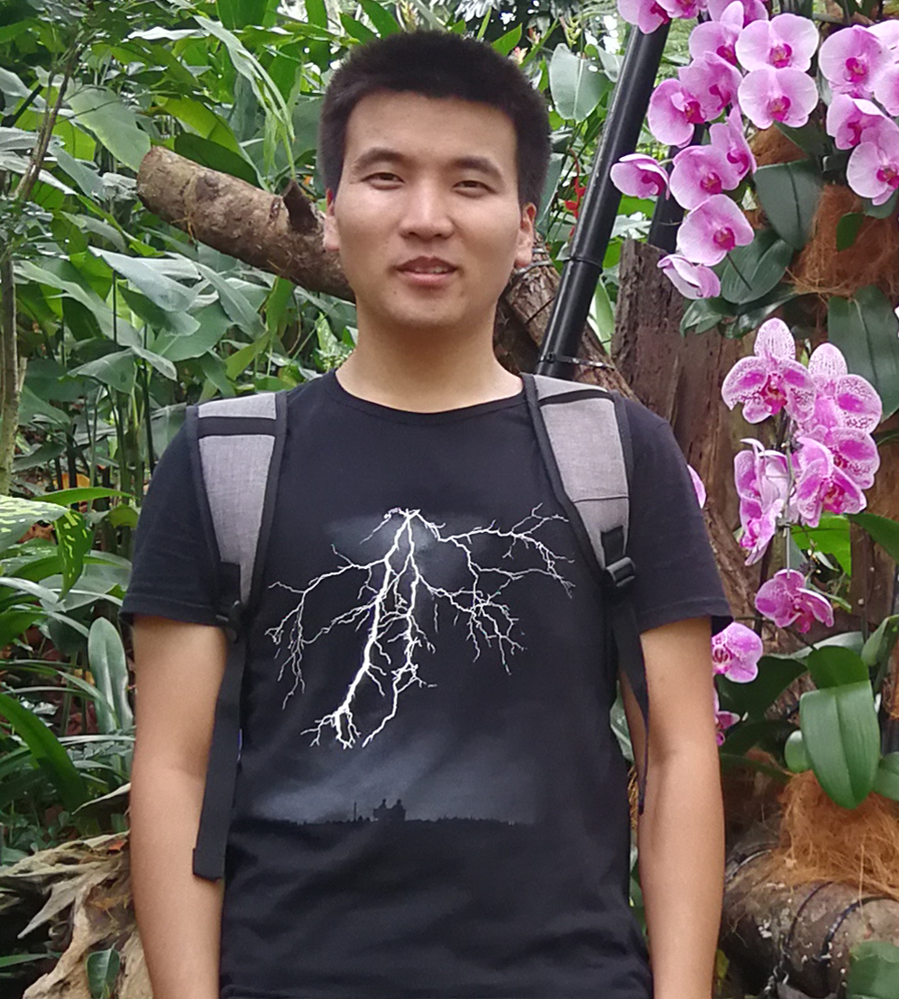

## About Me

I am now a Ph.D. candidate in the Department of Computer Science and Engineering, Shanghai Jiao Tong University, China, advised by Prof. Lizhuang Ma. My research interests lie in face analysis and deep learning, in particular, face alignment and facial expression recognition.

## News

I am now studying at Multimedia and Interactive Computing Lab of Nanyang Technological University as a research assistant, advised by Prof. Jianfei Cai.

## Publications

1. Z. Shao, H. Zhu, Y. Hao, M. Wang, and L. Ma, “Learning a multi-center convolutional network for unconstrained face alignment,” in IEEE International Conference on Multimedia and Expo (ICME). IEEE, 2017, pp. 109-114.
2. Z. Shao, S. Ding, Y. Zhao, Q. Zhang, and L. Ma, “Learning deep representation from coarse to fine for face alignment,” in IEEE International Conference on Multimedia and Expo (ICME). IEEE, 2016, pp. 1-6.
3. Z. Shao, S. Ding, H. Zhu, C. Wang, and L. Ma, “Face alignment by deep convolutional network with adaptive learning rate,” in IEEE International Conference on Acoustics, Speech and Signal Processing (ICASSP). IEEE, 2016, pp. 1283-1287.
4. H. Zhu, B. Sheng, Z. Shao, Y. Hao, X. Hou, and L. Ma, “Better initialization for regression-based face alignment,” Computers & Graphics, 2017.
5. H. Zhu, Z. Shao, Y. Hao, and L. Ma, “Better face alignment via better initialization,” in IEEE International Conference on Computer-Aided Design and Computer Graphics (CAD/Graphics). IEEE, 2017.
6. K. Tang, X. Hou, Z. Shao, and L. Ma, “Deep feature selection and projection for cross-age face retrieval,” in International Congress on Image and Signal Processing, BioMedical Engineering and Informatics (CISP-BMEI). IEEE, 2017, pp. 1-7.
7. Y. Zhao, Y. Li, Z. Shao, and H. Lu, “LSOD: Local sparse orthogonal descriptor for image matching,” in ACM International Conference on Multimedia (MM). ACM, 2016, pp. 232-236.

## Awards

Year | Award | Institute
-----|-------|--------
2017 |  Leo KoGuan Scholarship  | Shanghai Jiao Tong University
2016 |  Leo KoGuan Scholarship  | Shanghai Jiao Tong University

## Education

## Experiences
